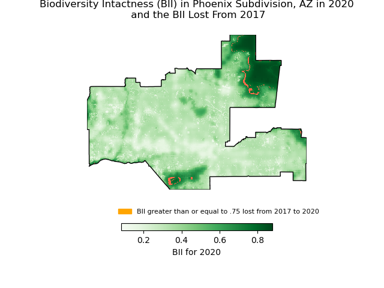

# Biodiversity_intactness

#### Emma Bea Mitchell | December 7th, 2014

### About: 

This notebook explores biodiversity intactness in the greater Phoenix, AZ area through mapping a biodiversity intactness index (BII). After exploring the data, we map the Phoenix Subdivision and the surrounding area to get an idea of where we are looking at. We then calculate the BII percentage change from 2017 to 2020 and map that change. 

#### Purpose:

The purpose of this notebook is to use maps tp explore the declining biodiversity in the Phoenix Subdivision.

#### Highlights:

- Navigating STAC data
- Narrowing down to information of interest in STAC data
- Using `rioxr.open_rasterio` to explore assets
- Removing bands with `.drop_vars` and `squeeze`
- Using map algebra to calculate BII differences in different years
- Using `matplotlib` to create detailed maps

#### Data:

The `io-biodiversity` data comes from the Microsoft Planetary Computer STAC catalog, which has open access to environmental data, intended for the use of building sustainable futures. We used the `planetary_computer` and `pystac_client` packages to load in this specific api data into our notebook. We then narrowed it down to `io-biodiversity` in the right years. 

The `counties` data comes from the governmental census, which creates shapefiles for political borders like counties. The data we downloaded in only for Arizona, making it easier to narrow down on the Phoenix Subdivision. All data from the government's census website is open access. 

#### References: 

Microsoft Planetary Computer. (2024). Microsoft.com. https://planetarycomputer.microsoft.com/dataset/io-biodiversity. Accessed 12-07-2024. 

‌Bureau, U. C. (2021). Cartographic Boundary Files - Shapefile. The United States Census Bureau. https://www.census.gov/geographies/mapping-files/time-series/geo/carto-boundary-file.html. Accessed 12-07-2024.

### Final Output:


A map of the Biodiversity Intactness Index of the Phoenix Subdivision documenting BII differences from 2017 to 2020. 

### Acknowledgements: 

I couldn't have completed this notebook without the help from my peers
This notebook is from an assignment in EDS 220 Working with Environmental Datasets, a graduate level course in the Master of Environmental Data Science program at the Bren School for Environmental Science and Management at UCSB. This class was taught by Carmen Galaz García, and TA'ed by Annie Adams. Without them or this class, none of this repository would be possible :) 

### Repository Organization 

```python
Biodiversity_intactness
│   README.md
|   biodiversity_intactness.ipynb
|   .gitignore
|   BII_map.png
│
└── data 
    │  cb_2023_04_cousub_500k.cpg
    │  cb_2023_04_cousub_500k.dbf
    │  cb_2023_04_cousub_500k.prj
    │  cb_2023_04_cousub_500k.shp
    │  cb_2023_04_cousub_500k.shp.ea.iso.xml
    │  cb_2023_04_cousub_500k.shp.iso.xml
    │  cb_2023_04_cousub_500k.shx
       
```

      
    